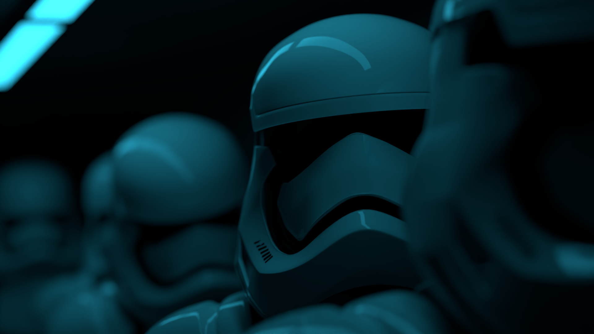
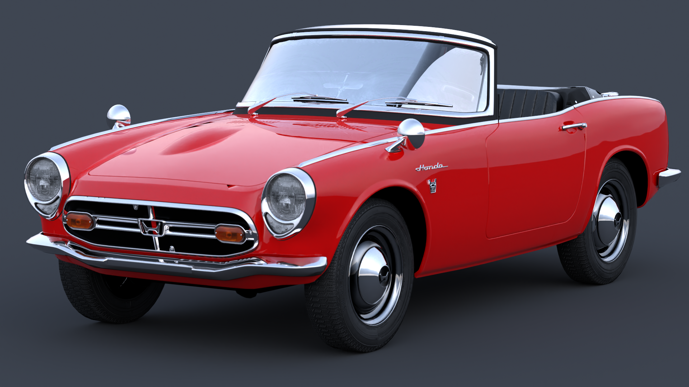
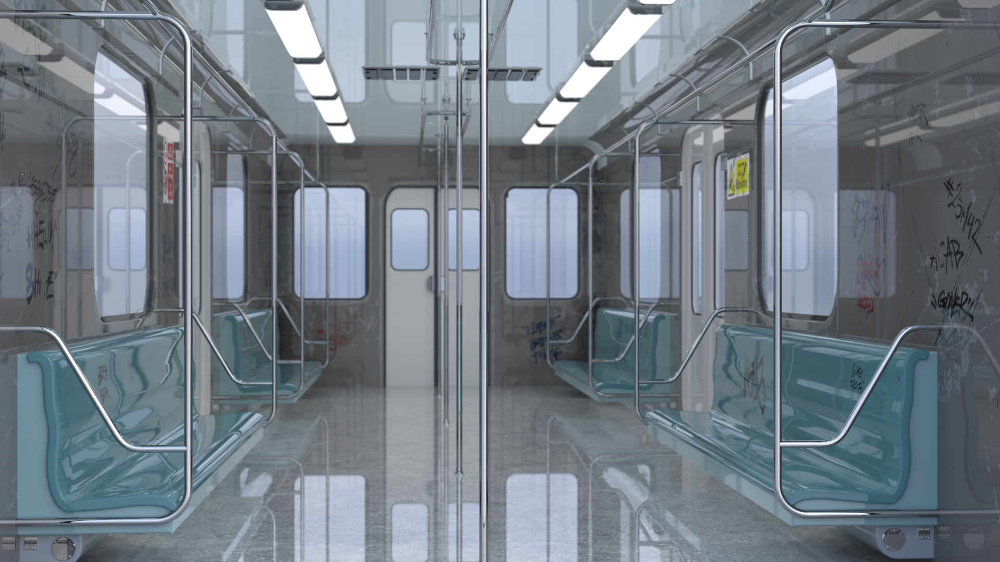

=============================

Renderama is a data-oriented path tracer written in Rust. What started out as a renderer based on Peter Shirley’s [Ray Tracing Minibook](https://raytracing.github.io/) series has over time morphed into a capable renderer with methods borrowed from [Physically Based Rendering](https://pbrt.org/) and from research papers by  [Pixar Animation Studios](https://research.pixar.com/) and [Walt Disney Animation Studios](https://disneyanimation.com/publications/).

---

