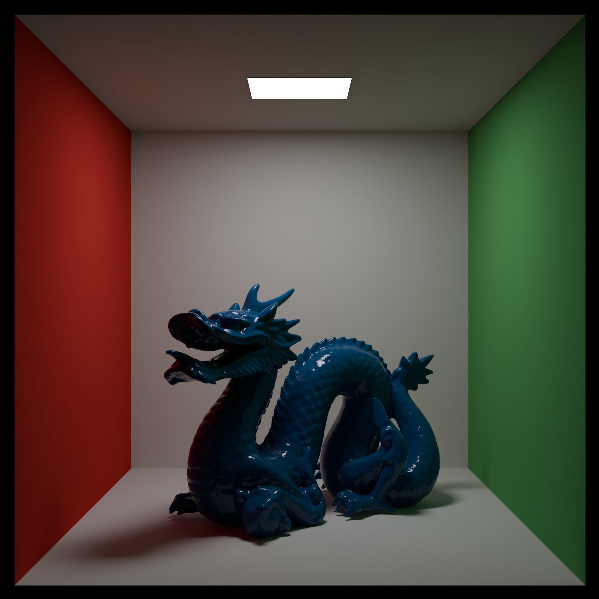

=============================

Renderama is a path tracer in progress based off of Peter Shirley's
[Ray Tracing Minibook](https://raytracing.github.io/) series with additional methods added from [Physically Based Rendering](https://pbrt.org/) and research papers from [Pixar Animation Studios](https://renderman.pixar.com/). 

