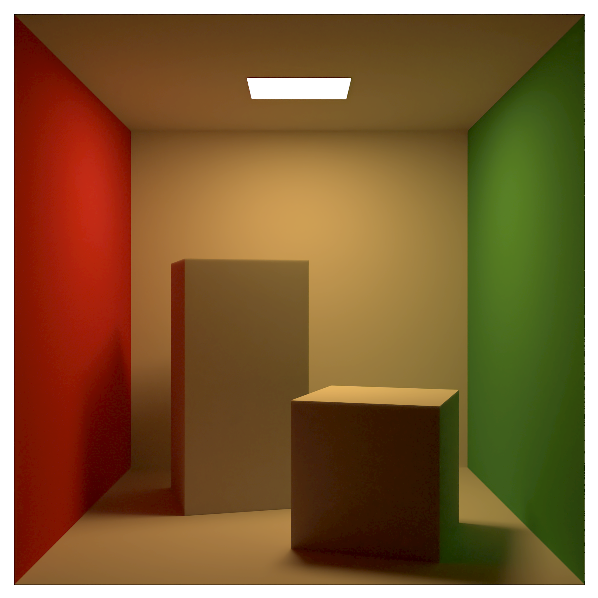

=============================

Illumine is a path tracer in progress based off of Peter Shirley's
Ray Tracing Minibook series and Matt Pharr, Wenzel Jakob,
and Greg Humphreys' Physically Based Rendering.

